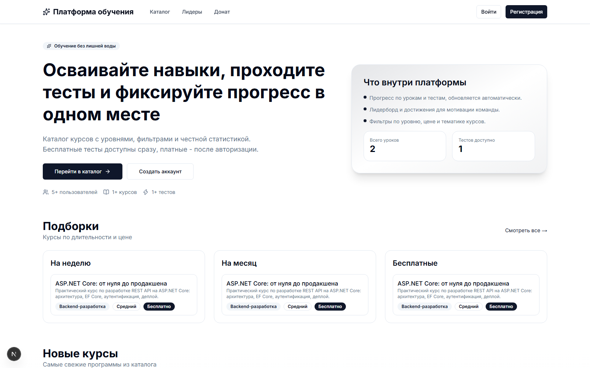
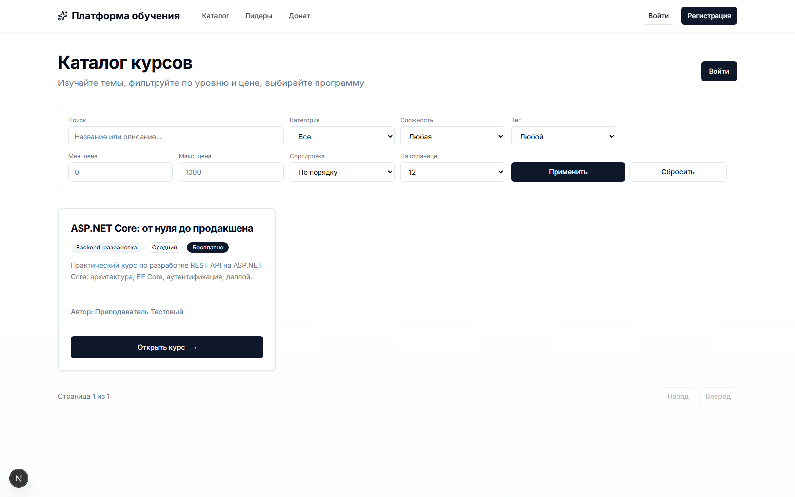
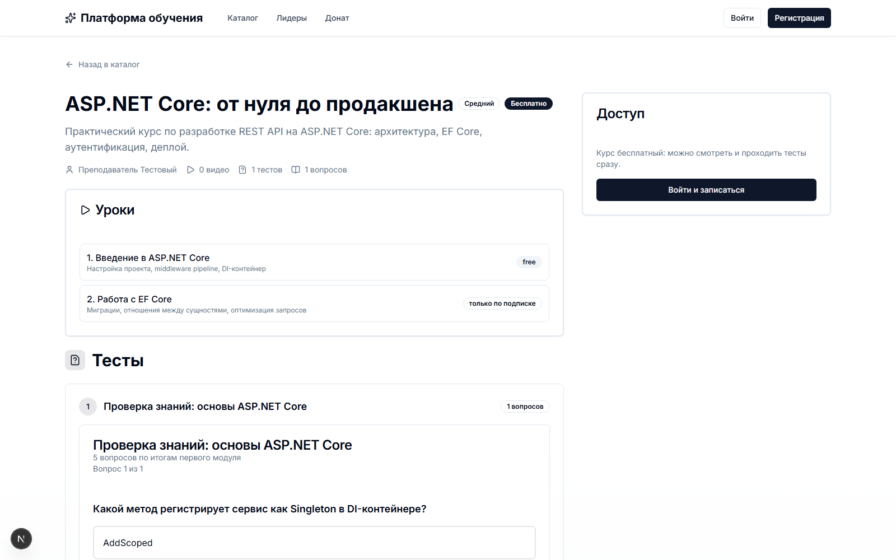
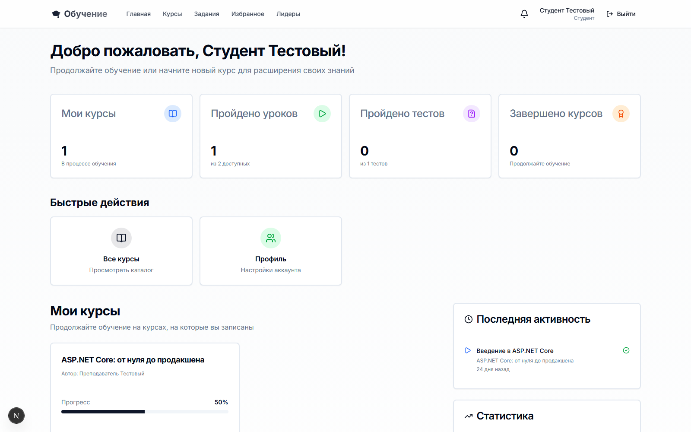
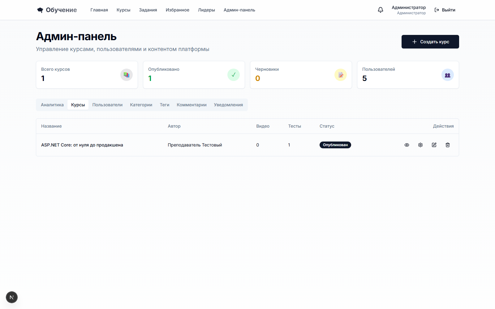

# Платформа онлайн-обучения

LMS на Next.js: курсы с видеоуроками, тесты, задания с проверкой преподавателем, автоматические сертификаты при завершении курса и админ-панель с аналитикой. Делал как дипломный проект, довёл до состояния рабочего демо.



## Что умеет

- Каталог курсов с фильтрами по уровню и цене, подборками по длительности и поиском
- Видеоуроки с отслеживанием прогресса по каждому пользователю
- Тесты с несколькими типами вопросов и проходным баллом
- Задания: студент сдаёт работу, преподаватель проверяет и ставит оценку
- Автоматическая выдача сертификата при 100% прохождении курса
- Комментарии с модерацией, уведомления, избранное, рейтинги курсов
- RBAC на пять ролей: STUDENT, TEACHER, MODERATOR, MANAGER, ADMIN



Страница курса, где уроки и тесты видно сразу, без лишних кликов:



Личный кабинет студента считает пройденные уроки, тесты и курсы:



Админ-панель, где видно курсы, пользователей, категории, теги, модерацию комментариев, аналитику:



## Стек

Next.js 16 (App Router) · React 19 · TypeScript · Prisma 7 (SQLite, driver adapters, без Rust-движка) · NextAuth v5 · Tailwind CSS 4 · React Hook Form + Zod · shadcn/ui

## Запуск

```bash
npm install
npx prisma generate
npx prisma db push
npm run create-admin
npm run dev
```

Приложение поднимется на `http://localhost:3000`. Учётные данные админа берутся из вывода `create-admin` (по умолчанию `admin@example.com` / `admin123`, переопределяются через `ADMIN_EMAIL` / `ADMIN_PASSWORD`). Для NextAuth нужен `NEXTAUTH_SECRET` в `.env`.

## Архитектура

- App Router поделён на группы роутов `(public)`, `(protected)`, `(auth)`: доступ проверяется на уровне layout и API
- RBAC-иерархия ролей проверяется и в API-роутах, и в UI (`src/lib/rbac.ts`)
- Prisma 7 работает через driver adapter (`better-sqlite3`) вместо встроенного Rust-движка, поэтому переезд на Postgres/MySQL требует замены только адаптера, схема не меняется

## Статус

Рабочий: собирается, разворачивается, ключевые сценарии (регистрация, прохождение курса, тест, задание, админ-панель) проверены руками. Автотестов нет.
